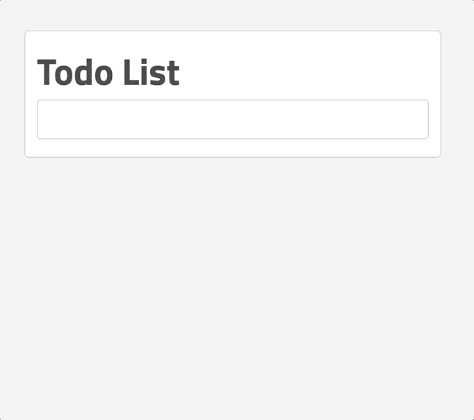

# Todo List

Réalisation d'une liste de tâches :

- ajouter une tâche à la liste
- valider une tâche quand elle est terminée
- supprimer une tâche de la liste

Faire attention de ne pas pouvoir ajouter une tâche avec une chaîne
de caractères vide.

